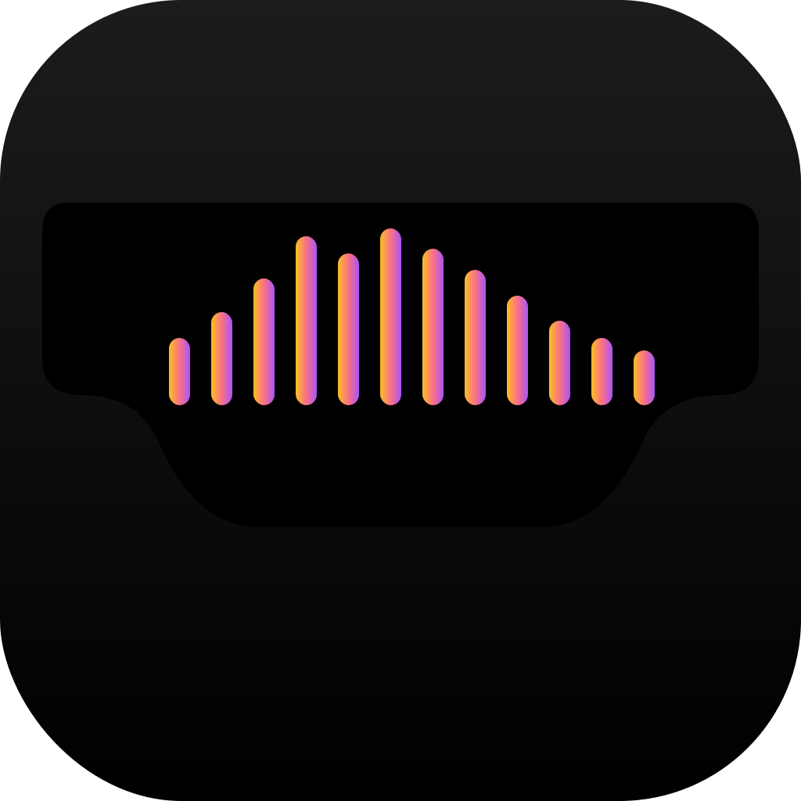
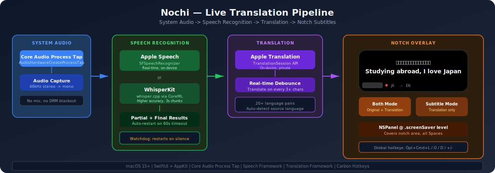
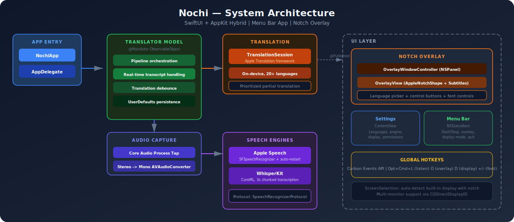

<div align="center">

**[English](README.md)** | **[日本語](README.ja.md)**



# Nochi (ノッチ)

### macOSのノッチ領域にリアルタイム字幕翻訳を表示するアプリ

<br>

[](https://swift.org)
[](https://developer.apple.com/macos/)
[](https://developer.apple.com/documentation/coreaudio)
[](https://developer.apple.com/documentation/translation)

[](https://developer.apple.com/documentation/speech)
[](https://github.com/argmaxinc/WhisperKit)
[](LICENSE)

<br>

</div>

---

## 概要

macOSのメニューバーアプリとして、Core Audio Process Tapで**システムオーディオ**（マイクではなく）をキャプチャし、**リアルタイム音声認識**を行い、**Appleのオンデバイス翻訳フレームワーク**で翻訳し、画面上部の**ノッチ型オーバーレイ**にライブ字幕を表示します。

YouTubeの動画、海外の会議、韓国語のポッドキャスト — Nochiはマイクに触れず、クラウドにデータを送信せずに、リアルタイム翻訳字幕を表示します。

**DRMブラックスクリーンなし** — ScreenCaptureKitと違い、Process Tapは画面収録ではなく`kTCCServiceAudioCapture`を使用するため、Netflix、Unextなどの動画が暗転しません。

---

## パイプライン

<div align="center">

</div>

---

## 機能

### オーディオキャプチャ
- **システムオーディオのみ** — Core Audio Process Tapで全システム音声をキャプチャ、マイク不要
- **DRM干渉なし** — 画面収録インジケータの代わりに紫のドットを表示、DRMアプリは正常に動作
- **設定不要** — システムオーディオ全体をステレオでキャプチャ、どのアプリでも動作

### 音声認識
- **Apple Speech** — `SFSpeechRecognizer`によるリアルタイム部分結果、可能な場合はオンデバイス処理
- **WhisperKit**（プラグイン対応） — CoreML対応Whisperモデル、3秒チャンク転写
- **自動再起動** — Apple Speechの約60秒タイムアウト時にシームレスに再起動
- **ウォッチドッグ** — 無音障害を検知して認識を強制再起動
- **ポーズ検出** — 句読点なしでも1.5秒の発話停止後に文を確定

### 翻訳
- **Apple Translation** — 完全オンデバイス、プライベート、APIキー不要
- **20以上の言語ペア** — 日本語、韓国語、中国語、スペイン語、フランス語、ドイツ語など
- **リアルタイム** — 文の確定を待たず、音声認識の部分結果をリアルタイム翻訳
- **部分翻訳優先** — ライブ部分翻訳が確定文の翻訳より優先され、表示の応答性を維持

### ノッチオーバーレイ
- **ノッチ型UI** — カスタム`AppleNotchShape`で丸みのある下部コーナー、ハードウェアノッチと一体化
- **2つの表示モード** — 「翻訳のみ」（クリーンな字幕）または「原文＋翻訳」（語学学習向け）
- **オーバーレイ内言語選択** — 設定画面を開かずにソース/ターゲット言語を切替
- **コントロールボタン** — 開始/停止、表示モード切替、フォントサイズ、終了
- **常に最前面** — `.screenSaver`レベルの`NSPanel`、全Spacesに表示

### グローバルホットキー
- **Carbon Events API** — アプリがバックグラウンドでも動作するシステム全体のショートカット

| ショートカット | アクション |
|------------|--------|
| `Opt+Cmd+L` | リスニング開始/停止 |
| `Opt+Cmd+O` | オーバーレイ表示切替 |
| `Opt+Cmd+D` | 表示モード切替 |
| `Opt+Cmd+=` | フォントサイズ拡大 |
| `Opt+Cmd+-` | フォントサイズ縮小 |

---

## アーキテクチャ

<div align="center">

</div>

---

## 主要ファイル

| ファイル | 役割 |
|---------|------|
| `NochiApp.swift` | `@main`エントリポイント、`@NSApplicationDelegateAdaptor` |
| `AppDelegate.swift` | メニューバー、オーバーレイコントローラ、ホットキー管理、Combineワイヤリング |
| `TranslatorModel.swift` | 中央の`@MainActor ObservableObject` — パイプライン状態、設定、UserDefaults |
| `AudioCaptureManager.swift` | Core Audio Process Tap — `AudioHardwareCreateProcessTap`によるシステムオーディオキャプチャ |
| `SpeechRecognizer.swift` | `SpeechRecognizerProtocol` + Apple Speech（自動再起動付き）+ WhisperKitスタブ |
| `TranslationService.swift` | Apple `TranslationSession`ラッパー |
| `OverlayWindowController.swift` | `.screenSaver`レベルの`NSPanel` — ノッチオーバーレイの配置と表示 |
| `OverlayView.swift` | `AppleNotchShape` + 字幕テキスト + 言語選択 + コントロールボタン |
| `ContentView.swift` | 設定UI — 言語、エンジン、表示モード、外観、権限 |
| `GlobalHotkeyManager.swift` | Carbon Eventsホットキー登録とディスパッチ |
| `ScreenSelection.swift` | マルチモニターディスプレイ選択（ノッチ付き内蔵ディスプレイ優先） |

---

## 音声認識エンジン

| エンジン | 仕組み | レイテンシ | 最適な用途 |
|---------|-------|---------|----------|
| **Apple Speech**（デフォルト） | `SFSpeechRecognizer`が部分＋最終結果をストリーム | リアルタイム | カジュアルな動画、会議、ポッドキャスト |
| **WhisperKit** | CoreML Whisperモデル、3秒チャンク転写 | 約3秒 | 高精度、ノイズの多い音声 |

設定でエンジンを切替できます。WhisperKitは[WhisperKit SPMパッケージ](https://github.com/argmaxinc/WhisperKit)の追加が必要です。

---

## 対応言語

ソースとターゲット言語は自由に組み合わせ可能です：

| ソース | ターゲット | 用途 |
|--------|----------|------|
| 日本語 | 英語 | アニメ、YouTube、会議 |
| 韓国語 | 英語 | 韓国ドラマ、ライブ配信 |
| スペイン語 | 英語 | 通話、ポッドキャスト |
| 英語 | 日本語 | 語学学習 |
| 中国語 | 英語 | 動画、カンファレンス |
| フランス語 | 英語 | 映画、会議 |

> Apple Translationがサポートする全ての言語ペアに対応。言語パックはシステム設定から初回使用時にダウンロード。

---

## 必要要件

- **macOS 15.0+**（Sequoia — Apple Translation frameworkに必要）
- **ノッチ付きMacBook**（ノッチなしでも動作、オーバーレイは画面上部に固定）
- **Xcode 16+**
- **オーディオ録音**権限（Core Audio Process Tapのシステムオーディオキャプチャに必要）
- **音声認識**権限（`SFSpeechRecognizer`に必要）
- 翻訳言語パック（システム設定 > 一般 > 言語と地域 > 翻訳の言語 からダウンロード）

---

## セットアップ

### 1. クローン

```bash
git clone https://github.com/jonpol01/Nochi.git
cd Nochi
```

### 2. ビルドと実行

```bash
open Nochi.xcodeproj
# Product -> Run (または Cmd+R)
```

CocoaPodsなし、SPM依存なし。純粋なAppleフレームワークのみ。

### 3. 権限を許可

初回起動時：
1. **オーディオ録音** — macOSがオーディオキャプチャ権限を要求します
2. **音声認識** — プロンプトで許可、またはシステム設定 > プライバシーとセキュリティ > 音声認識

### 4. 翻訳言語をダウンロード

**システム設定 > 一般 > 言語と地域 > 翻訳の言語** から必要な言語ペアをダウンロード（例：日本語＋英語）。

### 5. 翻訳開始

**Opt+Cmd+L** を押すか、メニューバーの波形アイコン > 「Start Listening」をクリック。音声を再生すると、ノッチに字幕が表示されます。

---

## WhisperKitの追加（任意）

ローカルWhisperモデルによる高精度音声認識：

1. Xcodeで **File > Add Package Dependencies** を開く
2. 入力: `https://github.com/argmaxinc/WhisperKit`
3. `SpeechRecognizer.swift`のスタブを実際のWhisperKit呼び出しに置換
4. モデル（約150MB）は初回使用時にダウンロード

---

## ライセンス

MIT

---

<div align="center">

**Swift、Core Audio Process Tap、Apple Speech、Apple Translationで構築**

</div>
