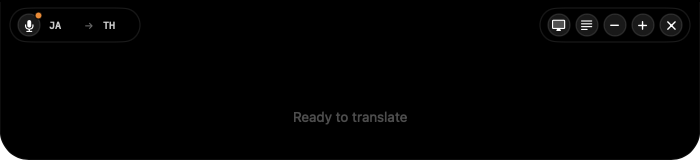
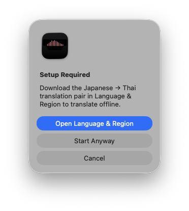
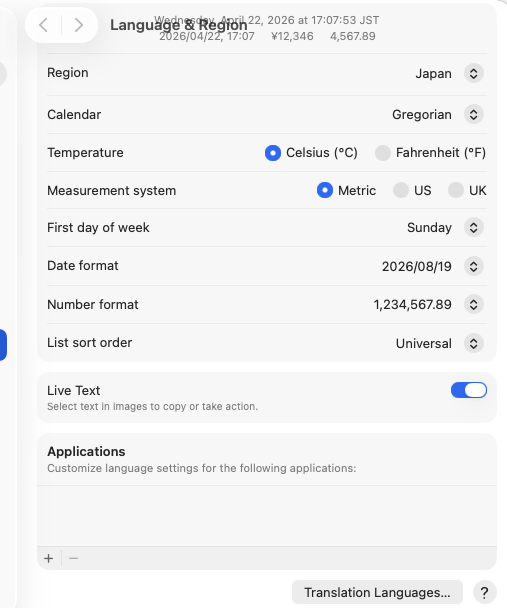

<div align="center">

**[English](README.md)** | **[日本語](README.ja.md)**


# Nochi (ノッチ)

### Real-time live translation of system audio displayed as subtitles in the macOS notch area.

<br>

[](https://swift.org)
[](https://developer.apple.com/macos/)
[](https://developer.apple.com/documentation/coreaudio)
[](https://developer.apple.com/documentation/translation)

[](https://developer.apple.com/documentation/speech)
[](https://github.com/argmaxinc/WhisperKit)
[](LICENSE)

<br>

</div>

---

## What It Does

A macOS menu bar app that captures **system audio** (not the microphone) via Core Audio Process Tap, performs **real-time speech recognition**, translates to a target language using **Apple's on-device Translation framework**, and displays live subtitles in a **notch-shaped overlay** pinned to the top of the screen.

Watch a YouTube video in Japanese, join a meeting in Spanish, or listen to a podcast in Korean — Nochi shows you live translated subtitles without touching your mic or sending anything to the cloud.

**No DRM black screens** — unlike ScreenCaptureKit, Process Tap uses `kTCCServiceAudioCapture` instead of screen recording, so DRM-protected apps (Netflix, Unext) won't black out their video.

---

## Pipeline

<div align="center">

</div>

---

## Features

### Audio Capture
- **System audio only** — captures all sound output via Core Audio Process Tap, no microphone needed
- **No DRM interference** — shows a purple dot instead of the screen recording indicator, DRM apps keep playing normally
- **Zero-config** — taps all system audio as stereo, works with any app

### Speech Recognition
- **Apple Speech** — `SFSpeechRecognizer` with real-time partial results, on-device when available
- **WhisperKit** (pluggable) — CoreML-accelerated Whisper for higher accuracy, 3-second chunked transcription
- **Auto-restart** — seamlessly restarts on Apple Speech's ~60s timeout
- **Watchdog** — detects silent failures and force-restarts recognition
- **Pause detection** — commits sentences after 1.5s speech pause, even without punctuation

### Translation
- **Apple Translation** — fully on-device, private, no API keys
- **20+ language pairs** — Japanese, Korean, Chinese, Spanish, French, German, and more
- **Real-time** — translates partial results as speech is recognized, not just final sentences
- **Prioritized partials** — live partial translations take priority over committed sentences for responsive display

### Notch Overlay
- **Notch-shaped UI** — custom `AppleNotchShape` with rounded lower corners, blends with the hardware notch
- **Two display modes** — "Translation Only" (clean subtitles) or "Original + Translation" (language learning)
- **In-overlay language picker** — switch source/target language without opening settings
- **Control buttons** — start/stop, display mode toggle, font size, quit
- **Always on top** — `NSPanel` at `.screenSaver` level, joins all Spaces, non-activating

### Global Hotkeys
- **Carbon Events API** — system-wide shortcuts that work even when the app is in the background

| Shortcut | Action |
|----------|--------|
| `Opt+Cmd+L` | Start / Stop listening |
| `Opt+Cmd+O` | Toggle overlay visibility |
| `Opt+Cmd+D` | Toggle display mode |
| `Opt+Cmd+=` | Increase font size |
| `Opt+Cmd+-` | Decrease font size |

---

## First-Run Onboarding

Nochi detects when on-device speech or translation models aren't installed for the selected language pair and guides users to download them — so they're never stuck wondering why transcription/translation isn't working.

### 1. Orange badge on the mic button

A subtle dot appears on the mic icon when the current source → target pair needs setup.

<div align="center">

</div>

### 2. Setup Required dialog

Clicking the mic button pops up a friendly dialog instead of silently failing. The user can jump straight to System Settings or start anyway (server-based).

<div align="center">

</div>

### 3. Deep-linked System Settings

The app opens the exact System Settings pane where the language pack can be downloaded.

<div align="center">
 Language & Region" />
</div>

Common pairs (JA↔EN, EN↔ES, EN↔ZH…) are pre-installed by macOS and never trigger the flow. It only appears for pairs that actually need a download — like `JA → TH` above.

---

## Architecture

<div align="center">

</div>

---

## Key Files

| File | Purpose |
|------|---------|
| `NochiApp.swift` | `@main` entry point with `@NSApplicationDelegateAdaptor` |
| `AppDelegate.swift` | Menu bar, overlay controller, hotkey manager, Combine wiring |
| `TranslatorModel.swift` | Central `@MainActor ObservableObject` — pipeline state, settings, UserDefaults |
| `AudioCaptureManager.swift` | Core Audio Process Tap — system audio capture via `AudioHardwareCreateProcessTap` |
| `SpeechRecognizer.swift` | `SpeechRecognizerProtocol` + Apple Speech (with auto-restart) + WhisperKit stub |
| `TranslationService.swift` | Apple `TranslationSession` wrapper for on-device translation |
| `OverlayWindowController.swift` | `NSPanel` at `.screenSaver` level — notch overlay positioning and visibility |
| `OverlayView.swift` | `AppleNotchShape` + subtitle text + language picker + control buttons |
| `ContentView.swift` | Settings UI — languages, engine, display mode, appearance, permissions |
| `GlobalHotkeyManager.swift` | Carbon Events hotkey registration and dispatch |
| `ScreenSelection.swift` | Multi-monitor display selection (prefers built-in with notch) |

---

## Speech Engines

| Engine | How It Works | Latency | Best For |
|--------|-------------|---------|----------|
| **Apple Speech** (default) | `SFSpeechRecognizer` streams partial + final results | Real-time | Casual video, meetings, podcasts |
| **WhisperKit** | CoreML Whisper model, 3-second chunked transcription | ~3s | Higher accuracy, noisy audio |

Switch engines in Settings. WhisperKit requires adding the [WhisperKit SPM package](https://github.com/argmaxinc/WhisperKit).

---

## Supported Languages

Source and target languages can be mixed freely. Common pairs:

| Source | Target | Use Case |
|--------|--------|----------|
| Japanese | English | Anime, YouTube, meetings |
| Korean | English | K-drama, livestreams |
| Spanish | English | Calls, podcasts |
| English | Japanese | Language learning |
| Chinese | English | Video, conferences |
| French | English | Film, meetings |

> Any pair supported by Apple Translation works. Language packs download on first use via System Settings.

---

## Requirements

- **macOS 15.0+** (Sequoia — required for Apple Translation framework)
- **MacBook with notch** (works without notch too, overlay pins to top of screen)
- **Xcode 16+**
- **Audio Recording** permission (for Core Audio Process Tap system audio capture)
- **Speech Recognition** permission (for `SFSpeechRecognizer`)
- Translation language packs (downloaded via System Settings > General > Language & Region > Translation Languages)

---

## Setup

### 1. Clone

```bash
git clone https://github.com/jonpol01/Nochi.git
cd Nochi
```

### 2. Build and run

```bash
open Nochi.xcodeproj
# Product -> Run (or Cmd+R)
```

No CocoaPods, no SPM dependencies for the base build. Pure Apple frameworks.

### 3. Grant permissions

On first launch:
1. **Audio Recording** — macOS will prompt for audio capture permission
2. **Speech Recognition** — grant when prompted, or via System Settings > Privacy & Security > Speech Recognition

### 4. Download translation languages

Go to **System Settings > General > Language & Region > Translation Languages** and download the language pair you need (e.g., Japanese + English).

### 5. Start translating

Press **Opt+Cmd+L** or click the waveform icon in the menu bar > "Start Listening". Play any audio and watch subtitles appear in the notch.

---

## Adding WhisperKit (optional)

For higher accuracy speech recognition via local Whisper models:

1. In Xcode, go to **File > Add Package Dependencies**
2. Enter: `https://github.com/argmaxinc/WhisperKit`
3. Replace the stub in `SpeechRecognizer.swift` with actual WhisperKit calls
4. The model (~150 MB) downloads on first use

---

## License

MIT

---

<div align="center">

**Built with Swift, Core Audio Process Tap, Apple Speech, and Apple Translation**

</div>
